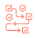
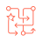

# Databricks product catalog

71 products across 8 categories.
Every icon is official Databricks artwork - see [README.md](README.md) for provenance.

## Platform & Compute  `#FF3621`

| | Product | Description |
|---|---|---|
|  | **[Databricks](https://www.databricks.com/)** <code>databricks</code> | The Databricks logo mark. Use it to label the platform boundary in an architecture diagram. |
|  | **[Data Intelligence Platform](https://www.databricks.com/product/data-intelligence-platform)** <code>data-intelligence-platform</code> | The unified platform for data engineering, analytics, AI and governance on one lakehouse foundation. |
|  | **[Lakehouse Architecture](https://www.databricks.com/product/data-lakehouse)** <code>lakehouse</code> | Open architecture combining data lake economics with warehouse reliability and ACID management. |
|  | **[Apache Spark](https://www.databricks.com/product/spark)** <code>apache-spark</code> | Managed, autoscaling Apache Spark for large-scale batch, streaming and ML processing. |
|  | **[Photon](https://www.databricks.com/product/photon)** <code>photon</code> | A native C++ vectorized query engine. It accelerates SQL and DataFrame work with no code changes. |
|  | **[Compute (Clusters)](https://docs.databricks.com/aws/en/compute/)** <code>compute-clusters</code> | All-purpose and job compute resources that run notebooks, pipelines and jobs. |
|  | **[Serverless Compute](https://www.databricks.com/product/serverless-compute)** <code>serverless-compute</code> | Fully managed, versionless compute that starts in seconds and autoscales without cluster administration. |
|  | **[Databricks Runtime](https://www.databricks.com/product/machine-learning-runtime)** <code>databricks-runtime</code> | An optimized runtime image with Spark, Delta and ML libraries. The ML variant adds GPU frameworks and AutoML. |
|  | **[Real-Time Mode for Apache Spark](https://www.databricks.com/product/data-engineering/spark-real-time-mode)** <code>spark-real-time-mode</code> | Structured Streaming execution mode delivering millisecond latency for time-critical pipelines. |
|  | **[Multicloud Deployment](https://www.databricks.com/product/data-intelligence-platform)** <code>multicloud</code> | The same platform and governance model deployed across AWS, Azure and Google Cloud. |

## Data Engineering  `#2272B4`

| | Product | Description |
|---|---|---|
|  | **[Lakeflow](https://www.databricks.com/product/data-engineering)** <code>lakeflow</code> | The unified data engineering suite covering ingestion, declarative transformation and orchestration. |
|  | **[Lakeflow Connect](https://www.databricks.com/product/data-engineering/lakeflow-connect)** <code>lakeflow-connect</code> | Managed ingestion with 100+ connectors for SaaS applications, databases and cloud storage. |
|  | **[Zerobus Ingest](https://www.databricks.com/product/data-engineering/lakeflow-connect/zerobus-ingest)** <code>zerobus-ingest</code> | Broker-free streaming ingest over gRPC, REST and OpenTelemetry with roughly five-second freshness. |
|  | **[Apache Spark Declarative Pipelines](https://www.databricks.com/product/data-engineering/spark-declarative-pipelines)** <code>spark-declarative-pipelines</code> Lakeflow Declarative Pipelines. Formerly Delta Live Tables (DLT) | Declarative batch and streaming ETL with built-in data quality expectations, CDC and dependency management. |
|  | **[Lakeflow Jobs](https://www.databricks.com/product/data-engineering/lakeflow-jobs)** <code>lakeflow-jobs</code> formerly Databricks Workflows | Native orchestration for data, analytics and AI workflows, with control flow, retries and alerting. |
|  | **[Lakeflow Designer](https://www.databricks.com/product/data-engineering/lakeflow-designer)** <code>lakeflow-designer</code> | No-code, drag-and-drop pipeline authoring that generates governed, production-ready pipeline code. |
|  | **[Auto Loader](https://docs.databricks.com/aws/en/ingestion/cloud-object-storage/auto-loader/)** <code>auto-loader</code> | Incrementally and idempotently ingests new files from cloud object storage as they arrive. |
|  | **[Structured Streaming](https://docs.databricks.com/aws/en/structured-streaming/)** <code>structured-streaming</code> | The Apache Spark API for exactly-once stream processing in continuous, incremental pipelines. |
|  | **[Lakebridge](https://www.databricks.com/solutions/migration)** <code>lakebridge</code> | Migration tooling that profiles legacy warehouses, converts code to ANSI SQL and validates the results. |

## Storage & Databases  `#00875C`

| | Product | Description |
|---|---|---|
|  | **[Delta Lake](https://www.databricks.com/product/delta-lake-on-databricks)** <code>delta-lake</code> | Open table format adding ACID transactions, time travel and change data feed to object storage. |
|  | **[Apache Iceberg](https://www.databricks.com/product/lakehouse-storage)** <code>apache-iceberg</code> | First-class managed and foreign Iceberg tables, readable and writable through Unity and Iceberg REST catalogs. |
|  | **[Lakehouse Storage (Managed Tables)](https://www.databricks.com/product/lakehouse-storage)** <code>lakehouse-storage</code> | Self-optimizing managed Delta and Iceberg tables with automatic layout, compaction and caching. |
|  | **[Liquid Clustering](https://docs.databricks.com/aws/en/delta/clustering)** <code>liquid-clustering</code> | Partition-free, self-tuning data layout that adapts clustering keys to real query patterns. |
|  | **[Predictive Optimization](https://docs.databricks.com/aws/en/optimizations/predictive-optimization)** <code>predictive-optimization</code> | AI-driven background maintenance that runs OPTIMIZE, VACUUM and statistics where they pay off most. |
|  | **[Lakebase](https://www.databricks.com/product/lakebase)** <code>lakebase</code> | Serverless Postgres OLTP database with branching, scale-to-zero and native lakehouse sync for apps and agents. |

## Analytics & BI  `#1B5162`

| | Product | Description |
|---|---|---|
|  | **[Databricks Lakehouse (Data Warehousing)](https://www.databricks.com/product/databricks-lakehouse)** <code>data-warehousing</code> | Serverless data warehouse built on open table formats and governed by Unity Catalog. |
|  | **[Databricks SQL](https://www.databricks.com/product/databricks-sql)** <code>databricks-sql</code> | The SQL surface of the lakehouse: warehouses, editor, queries, alerts and BI connectivity. |
|  | **[SQL Warehouse](https://docs.databricks.com/aws/en/compute/sql-warehouse/)** <code>sql-warehouse</code> | Serverless, Photon-powered SQL compute endpoint for BI tools, dashboards and ad hoc queries. |
|  | **[Lakehouse//RT](https://www.databricks.com/product/lakehouse/real-time-lakehouse)** <code>lakehouse-rt</code> | Real-time warehouse tier serving millisecond queries at high concurrency directly on lake tables. |
|  | **[Databricks AI/BI](https://www.databricks.com/product/business-intelligence)** <code>ai-bi</code> | The built-in business intelligence experience spanning dashboards, Genie spaces and semantics. |
|  | **[AI/BI Dashboards](https://www.databricks.com/product/business-intelligence/ai-bi-dashboards)** <code>ai-bi-dashboards</code> | Dashboards with natural-language chart authoring and forecasting. Publication needs no separate license. |
|  | **[Lakehouse Federation](https://docs.databricks.com/aws/en/query-federation/)** <code>lakehouse-federation</code> | Query and govern external systems such as Snowflake, BigQuery, Postgres and MySQL in place, without moving data. |

## AI & Agents  `#98102A`

| | Product | Description |
|---|---|---|
|  | **[Databricks Genie](https://www.databricks.com/product/business-intelligence)** <code>genie</code> | The agentic AI experience that answers questions and acts on governed enterprise data. |
|  | **[Genie One](https://www.databricks.com/product/genie/one)** <code>genie-one</code> | AI coworker hub where business users ask questions, get grounded answers and trigger agentic actions. |
|  | **[Genie Agents](https://www.databricks.com/product/genie/agents)** <code>genie-agents</code> formerly AI/BI Genie spaces | Governed natural-language analytics spaces that answer business questions over curated data. |
|  | **[Genie Code](https://www.databricks.com/product/genie/code)** <code>genie-code</code> | Agentic coding partner for data teams that builds pipelines, dashboards, notebooks and ML workflows. |
|  | **[Genie Deep Research](https://www.databricks.com/product/genie/one)** <code>genie-deep-research</code> | Multi-step research agent that investigates a question across governed data and returns a cited report. |
|  | **[Agent Bricks](https://www.databricks.com/product/artificial-intelligence/agent-bricks)** <code>agent-bricks</code> | Platform for building, evaluating and governing enterprise AI agents grounded in your own data. |
|  | **[Databricks AI Search](https://www.databricks.com/product/artificial-intelligence/ai-search)** <code>ai-search</code> formerly Databricks Vector Search / Mosaic AI Vector Search | Managed hybrid vector and BM25 search with auto-syncing indexes and built-in reranking. |
|  | **[Unity AI Gateway](https://www.databricks.com/product/artificial-intelligence/unity-ai-gateway)** <code>unity-ai-gateway</code> | Single control plane for model, MCP and agent access with guardrails, rate limits, budgets and audit. |
|  | **[Document Intelligence](https://www.databricks.com/product/artificial-intelligence/document-intelligence)** <code>document-intelligence</code> | SQL-native parsing, extraction and classification that turns PDFs and images into governed structured data. |
|  | **[Databricks Model Serving](https://www.databricks.com/product/model-serving)** <code>model-serving</code> formerly Mosaic AI Model Serving | Unified serverless endpoints for custom ML models, foundation models and agents, plus batch inference. |
|  | **[Databricks Model Training](https://www.databricks.com/product/machine-learning/mosaic-ai-training)** <code>model-training</code> | Managed fine-tuning and custom model training on serverless H100 GPUs, without moving data. |
|  | **[Managed MLflow](https://www.databricks.com/product/managed-mlflow)** <code>mlflow</code> | Hosted MLflow for experiment tracking, GenAI tracing, evaluation and the Unity Catalog model registry. |
|  | **[Databricks Feature Store](https://www.databricks.com/product/feature-store)** <code>feature-store</code> | Governed feature registry with batch and low-latency online serving, and training/serving consistency. |
|  | **[AI Functions](https://docs.databricks.com/aws/en/large-language-models/ai-functions)** <code>ai-functions</code> | SQL functions such as ai_query, ai_classify and ai_extract that call models directly inside queries. |
|  | **[Databricks AutoML](https://www.databricks.com/product/automl)** <code>automl</code> | Glass-box automated training that produces baseline models plus the editable notebooks that built them. |
|  | **[CustomerLake](https://www.databricks.com/product/customerlake-cdp)** <code>customerlake</code> | Agentic customer data platform with identity resolution, Customer 360 and marketing agents, native to the lakehouse. |

## Governance & Security  `#1B3139`

| | Product | Description |
|---|---|---|
|  | **[Unity Catalog](https://www.databricks.com/product/unity-catalog)** <code>unity-catalog</code> | Unified governance for data, models, agents and MCP servers across clouds, under one permission model. |
|  | **[Unity Catalog Semantics](https://www.databricks.com/product/unity-catalog/business-semantics)** <code>unity-catalog-semantics</code> | Central semantic layer of metric views and business definitions that grounds BI tools and AI agents. |
|  | **[Data & AI Lineage](https://docs.databricks.com/aws/en/data-governance/unity-catalog/data-lineage)** <code>data-lineage</code> | Automatic column-level lineage across tables, dashboards, models and agents for impact analysis and audit. |
|  | **[Attribute-Based Access Control](https://docs.databricks.com/aws/en/data-governance/unity-catalog/abac/)** <code>abac</code> | Tag- and attribute-driven policies that enforce row, column and object permissions at scale. |
|  | **[Data Quality Monitoring](https://www.databricks.com/product/machine-learning/lakehouse-monitoring)** <code>data-quality-monitoring</code> formerly Lakehouse Monitoring | Automated profiling, freshness checks and anomaly detection over tables and inference logs. |
|  | **[Lakewatch](https://www.databricks.com/product/lakewatch)** <code>lakewatch</code> | Open agentic SIEM for petabyte-scale security logs, detection-as-code and AI-assisted threat hunting. |
|  | **[System Tables](https://docs.databricks.com/aws/en/admin/system-tables/)** <code>system-tables</code> | Built-in analytical tables exposing billing, usage, lineage, audit and job history for observability. |
|  | **[Enterprise Security](https://www.databricks.com/trust/security-features)** <code>enterprise-security</code> | Network isolation, customer-managed keys, private connectivity and compliance controls for the workspace. |

## Sharing & Collaboration  `#BA7B23`

| | Product | Description |
|---|---|---|
|  | **[Delta Sharing](https://www.databricks.com/product/delta-sharing)** <code>delta-sharing</code> | An open protocol for live, zero-copy data sharing across clouds, platforms and organizations. |
|  | **[OpenSharing](https://www.databricks.com/product/opensharing)** <code>opensharing</code> | Linux Foundation standard extending governed sharing to data, models and agents across engines and clouds. |
|  | **[Databricks Marketplace](https://www.databricks.com/product/marketplace)** <code>marketplace</code> | Open exchange for datasets, models, notebooks, dashboards and solution accelerators. |
|  | **[Databricks Clean Rooms](https://www.databricks.com/product/collaboration/clean-rooms)** <code>clean-rooms</code> | Privacy-safe multi-party collaboration on shared data with no raw-data access, across clouds. |
|  | **[Partner Connect](https://www.databricks.com/partnerconnect)** <code>partner-connect</code> | Guided setup that wires validated ingestion, BI and governance partner tools into your workspace. |

## Developer Tools & Apps  `#618794`

| | Product | Description |
|---|---|---|
|  | **[Databricks Apps](https://www.databricks.com/product/databricks-apps)** <code>databricks-apps</code> | Serverless hosting for Python data and AI apps built with Streamlit, Dash or Gradio, with Unity Catalog auth. |
|  | **[Databricks Notebooks](https://www.databricks.com/product/collaborative-notebooks)** <code>notebooks</code> | Collaborative multi-language notebooks with built-in visualisation, versioning and AI assistance. |
|  | **[Databricks Workspace](https://docs.databricks.com/aws/en/workspace/)** <code>workspace</code> | A collaborative environment. It groups the notebooks, queries, dashboards, jobs and files of each team. |
|  | **[Git Folders (Repos)](https://www.databricks.com/product/repos)** <code>git-folders</code> | Workspace folders backed by Git for branch-based development and CI/CD. |
|  | **[Databricks Asset Bundles](https://docs.databricks.com/aws/en/dev-tools/bundles/)** <code>asset-bundles</code> | Infrastructure-as-code packaging of jobs, pipelines and apps for repeatable multi-environment deploys. |
|  | **[Databricks CLI](https://docs.databricks.com/aws/en/dev-tools/cli/)** <code>databricks-cli</code> | Command-line client for workspaces, jobs, compute, Unity Catalog and bundle deployment. |
|  | **[Databricks Connect](https://docs.databricks.com/aws/en/dev-tools/databricks-connect/)** <code>databricks-connect</code> | Run local DataFrame code against remote Databricks compute from any IDE or application. |
|  | **[IDE Integrations](https://www.databricks.com/product/data-science/ide-integrations)** <code>ide-integrations</code> | Official VS Code and PyCharm extensions for editing, syncing, running and debugging on Databricks. |
|  | **[REST API & SDKs](https://docs.databricks.com/api/workspace/introduction)** <code>rest-api</code> | Programmatic control of every platform resource, with official Python, Java, Go and JavaScript SDKs. |
|  | **[Databricks Terraform Provider](https://registry.terraform.io/providers/databricks/databricks/latest/docs)** <code>terraform-provider</code> | Official Terraform provider for declaring workspaces, compute, Unity Catalog objects and permissions. |
