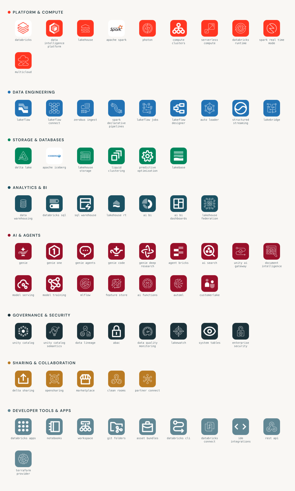
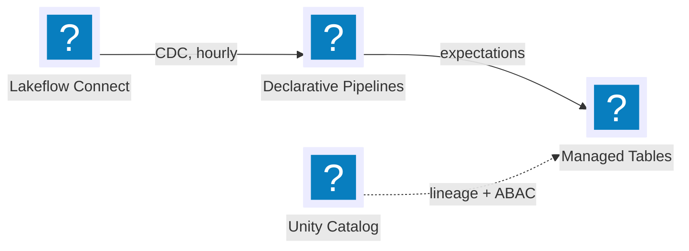
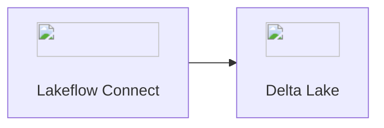

# Databricks Architecture Icons

Build architecture diagrams with official Databricks artwork.

> **Unofficial.** This is an independent community set. Databricks does not sponsor or endorse it. Read [Trademarks](#trademarks-and-what-this-project-is-not).

An architecture diagram shows the design, the deployment, and the topology of a system. This set gives each Databricks product one mark at one canvas size. It covers 71 products in 8 categories and gives five render variants for each product.

Use the icons in a diagram, a presentation, a document, or a poster. They work with Mermaid, Miro, Lucidchart, draw.io, Excalidraw, Figma, PowerPoint, Keynote, and Google Slides.

**[Browse the icons](https://oieduardorabelo.github.io/databricks-architecture-icons/)** ·
[Mermaid demo](https://oieduardorabelo.github.io/databricks-architecture-icons/examples/mermaid-architecture.html) ·
[catalog.json](https://oieduardorabelo.github.io/databricks-architecture-icons/catalog.json)

Open [`index.html`](index.html) to search the set and to download the files.

```
71 products · 8 categories · 48×48 SVG · 256px PNG · Iconify pack for Mermaid
```



---

## Where the artwork comes from

Nothing in this library is redrawn. Every icon is an official Databricks SVG file. The files come from Databricks URLs. The `sources/` directory holds each original file. The [manifest](sources/MANIFEST.md) gives the source URL of each file.

The library uses two icon families that Databricks publishes:

| Family | Description | Example |
|---|---|---|
| Product icons | Named product marks from databricks.com | `icon-lakeflow`, `icon-lakebase`, `icon-genie`, `icon-unity-catalog`, `icon-mosaic-ai-bricks`, `icon-customerlake`, `icon-lakehouse-rt` |
| Primary icon set | The Lava line-icon system on the Databricks product pages | `primary-icon-orange-*`, `icon-orange-*`, and outline glyphs such as `clusterIcon`, `dashboardIcon`, `notebookIcon` |

The Databricks icons use two colors. A Lava foreground (`#FF5F46` or `#FF3621`) goes over a light Lava tint (`#FABFBA`). Some icons also have a white background plate. Each variant keeps these three roles separate.

### What the build changes

The build applies four mechanical transforms. It makes no other change.

1. **Fit.** The build fits the source `viewBox` into a padded 48×48 square. The aspect ratio does not change.
2. **Namespace.** The build adds the product slug to each `id`, each `url(#…)` reference, and each CSS class. Then two icons can share one document. Their gradients and clip paths do not collide.
3. **Recolor.** The build recolors the `svg-mono/` and `svg-tile/` variants only. It maps the foreground, the tint, and the white plate separately. Therefore the two-color relation stays correct. The build never recolors a `kind: "logo"` entry.
4. **Remove white plates.** Some icons have a full-bleed white background. This background looks like an opaque box on a dark diagram. The build removes such a shape only when it covers 92% or more of the canvas. The build never removes a shape inside `<clipPath>` or `<mask>`.

The `svg/` directory holds the published artwork. Only steps 1, 2, and 4 apply to it.

---

## Brand compliance

The library follows the published [Databricks Extended Brand Guidelines](https://brandguides.brandfolder.com/databricks-extended-brand-guidelines).

**Color.** All eight category colors are exact values from the primary palette and the extended palette. Databricks gives this purpose for the extended palette: "a functional need for additional shades of color to enhance the comprehension of a message or to provide additional clarity through visual hierarchy". A color code on a diagram layer has this purpose.

The guidelines also say to "follow accessibility standards for contrast". The build calculates the contrast of the white glyph on each tile. If one value is less than 3:1, the build fails. WCAG 2.2 SC 1.4.11 gives 3:1 as the minimum for non-text content.

**Typography.** The page `index.html` uses DM Sans for text and DM Mono for code. These are the two typefaces in the guidelines. The page uses the 8px type scale, a line height of 150% for body text, and a line height of 120% for headlines.

**Logo.** The guidelines give the instruction "Don't recolor the logo" in the section *What to avoid*. Therefore the catalog marks the Databricks logo as `kind: "logo"`. This mark keeps the logo out of the recolor step. The files `svg-mono/databricks.svg` and `svg-tile/databricks.svg` hold the unaltered logo. This project also does not use the Databricks logo as its own logo or favicon, because that use can imply an official relation.

**Where this project extends the brand.** Databricks does not publish a tile treatment for product icons. The `svg-tile/` variant is a white glyph on a category-color square with round corners. This variant is a convention of this project. It comes from the AWS and Azure architecture icon sets. It uses Databricks colors, but Databricks does not specify it. For strict brand compliance, use the `svg/` variant. That variant is the artwork as Databricks publishes it.

### Trademarks, and what this project is not

- Databricks, the Databricks logo, and the product names are trademarks of **Databricks, Inc.** This project is independent and unofficial. Databricks does not sponsor or endorse it.
- The files `logos/apache-spark.svg` and `logos/apache-iceberg.svg` are trademarks of the **Apache Software Foundation**. The file `logos/terraform.svg` is a trademark of **HashiCorp**.
- You can use the catalog text, the build script, and `index.html` for any purpose.
- A label on a Databricks product in a technical diagram is a descriptive use. **Before you use these assets commercially or in public material, speak to Databricks.**

> Databricks also publishes its internal UI icon set as [`@databricks/design-system`](https://www.npmjs.com/package/@databricks/design-system). This is the DuBois system. It has an ISC license and approximately 400 glyphs. This library ships no file from that package. The package is a good source when you extend the library. Read [Extending](#extending).

---

## Layout

```
databricks-architecture-icons/
├── index.html            visual browser with search (open this first)
├── preview.png           the contact sheet above
├── CATALOG.md            the full product table
├── catalog.json          machine-readable catalog: name, description, category, file paths
├── catalog.csv           the same data for a spreadsheet
├── svg/                  official color artwork, 48×48, transparent      ← default
├── svg-mono/             one color, inherits `currentColor`              ← for themes
├── svg-tile/             white glyph on a category-color tile            ← for architecture diagrams
├── png/                  256×256 transparent PNG of svg/
├── png-tile/             256×256 PNG of svg-tile/
├── logos/                full-color brand lockups (Spark, Delta Lake, MLflow, and more)
├── zips/                 one archive for each collection and each category
├── iconify/               the Iconify packs: databricks-color.json, databricks.json, databricks.js
├── drawio/                a draw.io shape library with all 71 icons
├── examples/             a Mermaid page with live diagrams and every icon
├── sources/              the original Databricks files and MANIFEST.md
└── tools/                products.mjs (the catalog) and build.mjs (the generator)
```

### Which variant to use

| Requirement | Variant |
|---|---|
| Correct Databricks branding | `svg/` |
| Diagram nodes with a color code for each layer | `svg-tile/` |
| Icons that take the text color of the diagram, or dark mode | `svg-mono/` |
| A tool that does not accept SVG (some slide tools, older Miro boards) | `png/`, `png-tile/` |
| A title slide or a "powered by" slide | `logos/` |

### Downloads

The `zips/` directory holds one archive for each collection:

- One archive for each variant: `svg`, `svg-mono`, `svg-tile`, `png`, `png-tile`, `logos`.
- One archive for each category, with all five variants of the products in that category.
- One archive named `all` with every variant, the Iconify pack, and the catalog files.

The page `index.html` shows a download button for each archive. The button for a category is on the heading of that category.

---

## Hosting on GitHub Pages

The site is a set of static files with relative paths. It works at any base path. A build step and a configuration file are not necessary.

1. Push this folder to a repository. For a project site, the folder name becomes the URL path.
2. Open **Settings → Pages → Source: Deploy from a branch**. Select your branch and `/ (root)`.
3. Open the site. This set is published at
   <https://oieduardorabelo.github.io/databricks-architecture-icons/>.

The repository contains a `.nojekyll` file. This file makes Pages serve the tree without Jekyll. The entry point is `index.html`. The Mermaid demo gets the icon pack from a relative path. Therefore the demo works on the same origin.

To serve the site on your computer, run one of these commands:

```bash
npx serve .
python3 -m http.server
```

You can open `index.html` from `file://` to browse the library. The Mermaid demo needs HTTP, because a browser blocks `fetch()` on `file://`.

---

## How to use the icons

### Mermaid

The directory `iconify/` holds the same Iconify pack in two forms. Mermaid can register either one. Then you get icon nodes instead of images. The page [`examples/mermaid-architecture.html`](examples/mermaid-architecture.html) is a working example.

There are two packs. They hold the same icons with different colors.

| Pack prefix | Color | Use it for |
|---|---|---|
| `databricks-color` | The Databricks Lava artwork | A normal diagram. The icons keep the brand colors. |
| `databricks` | One color, inherits `currentColor` | A dark theme, or a diagram with its own palette. Mermaid gives the icon the text color of the diagram. |

Each pack has two files:

| File | Use it for |
|---|---|
| `databricks-color.json`, `databricks.json` | A web application on a server. Get the file with `fetch()`. |
| `databricks.js` | A page that must also work from `file://`. It sets both packs as globals. |

A browser blocks `fetch()` of a `file://` URL. If the pack does not load, Mermaid draws a "?" for each icon. To make a page work from disk, use `databricks.js` with a classic script tag:

```html
<script src="iconify/databricks.js"></script>
<script type="module">
  mermaid.registerIconPacks([
    { name: 'databricks-color', icons: window.databricksColorIconPack },
    { name: 'databricks', icons: window.databricksIconPack },
  ]);
</script>
```

```js
import mermaid from 'mermaid';

mermaid.registerIconPacks([
  {
    name: 'databricks-color',
    // A relative path. A leading slash points at the domain root, and a
    // GitHub Pages project site puts the library under /<repo>/ instead.
    // Or point at the published copy:
    // https://oieduardorabelo.github.io/databricks-architecture-icons/iconify/databricks-color.json
    loader: () => fetch('iconify/databricks-color.json').then((r) => r.json()),
  },
]);

mermaid.initialize({ startOnLoad: false, flowchart: { htmlLabels: false } });

// Render each diagram with an explicit id. mermaid.run() takes each SVG id from
// Date.now(). Two diagrams that render in the same millisecond get the same id.
// Then the content of the second diagram goes into the <svg> of the first one.
for (const [i, el] of [...document.querySelectorAll('pre.mermaid')].entries()) {
  const { svg } = await mermaid.render(`diagram-${i}`, el.textContent.trim());
  el.innerHTML = svg;
}
```

#### `architecture-beta`

```mermaid
architecture-beta
    group ingest(databricks-color:lakeflow)[Ingest]
    group lake(databricks-color:unity-catalog)[Governed Lakehouse]
    group serve(databricks-color:ai-bi)[Serve]

    service crm(databricks-color:lakeflow-connect)[Lakeflow Connect] in ingest
    service events(databricks-color:zerobus-ingest)[Zerobus Ingest] in ingest

    service bronze(databricks-color:delta-lake)[Delta Lake] in lake
    service etl(databricks-color:spark-declarative-pipelines)[Declarative Pipelines] in lake
    service gold(databricks-color:lakehouse-storage)[Managed Tables] in lake

    service wh(databricks-color:sql-warehouse)[SQL Warehouse] in serve
    service dash(databricks-color:ai-bi-dashboards)[Dashboards] in serve
    service genie(databricks-color:genie-agents)[Genie Agents] in serve

    crm:R --> L:bronze
    events:R --> B:bronze
    bronze:R --> L:etl
    etl:R --> L:gold
    gold:R --> L:wh
    wh:R --> L:dash
    wh:B --> T:genie
```



The icon id is `<pack>:<slug>`, for example `databricks-color:lakeflow`. [`CATALOG.md`](CATALOG.md) lists every slug. You can also click a slug in `index.html` to copy it.

This diagram type has two limits. It has no labels on the edges. Also, two services that point the same direction at the same target go on top of each other. To separate them, put the second edge on a different side, as in `events:R --> B:bronze`.

#### `flowchart` with icon nodes

A flowchart uses the same pack through the `@{ icon: … }` node shape. This shape needs Mermaid 11.3 or later. A flowchart gives you edge labels, subgraphs, and every layout direction.



#### PNG files in a diagram

An Iconify pack must hold SVG markup. Therefore `architecture-beta` and the `@{ icon: … }` shape cannot use a PNG file. A flowchart can use a PNG file in a node label with an `` tag. This method needs `htmlLabels: true` and `securityLevel: 'loose'`.



Load each image before you render the diagram. Mermaid measures an HTML label as it renders. An `` tag with no image in the cache measures as zero, and the node then collapses.

The SVG pack is better for most work. It gives sharp icons at all sizes, it takes the diagram colors, and it needs no image files. Use PNG files only for a renderer that cannot register an icon pack but does accept HTML labels.

#### Renderers that you do not control

GitHub, GitLab, and Kroki render Mermaid on the server. You cannot register an icon pack there. These renderers also remove `` from node labels. For these renderers, put the icons near the diagram and not inside it. A Markdown table of `svg-tile/` images always works. The build makes `CATALOG.md` in this way.

### draw.io / diagrams.net

The file `drawio/databricks-architecture-icons.xml` is a draw.io shape library. It holds all
71 icons and each one points at the copy on the published site.

**[Open draw.io with the library loaded](https://app.diagrams.net/?splash=0&clibs=Uhttps%3A%2F%2Foieduardorabelo.github.io%2Fdatabricks-architecture-icons%2Fdrawio%2Fdatabricks-architecture-icons.xml)**

The icons then appear in a section of the shape panel. To load the library by hand instead,
open **File → Open Library from → Device** and select the file.

The link uses the `clibs` parameter of draw.io. The value is `U` and then the URL of the
library, percent-encoded. To load more than one library, separate them with a semicolon.

### Miro

Drag the files from `svg/` or `svg-tile/` onto the board. Miro imports an SVG file as a vector shape. You can recolor it and resize it without a loss of quality. To make a set for later use, select several icons, group them, and save the group to the *Custom shapes* library of your team.

### Lucidchart

1. Open **File → Import → Images**.
2. Select the `svg/` directory. Lucid keeps the files as vectors.

To make a shape library, open **Shapes → Manage Shapes → Custom Shape Libraries → New**. Add the icons. Lucid then finds them by file name. The file names are the product slugs for this reason.

### draw.io / diagrams.net

- For one diagram, open **Extras → Edit Diagram**. Then use `shape=image;image=data:image/svg+xml,<url-encoded svg>`.
- For repeated use, open **Extras → Edit Shape Library**. Add entries that point to the files in `png/`. As an alternative, import the SVG files onto an empty page and copy them from there.

### Excalidraw, Figma, Keynote, PowerPoint, Google Slides

Drag the files from `svg/` onto the canvas. All of these tools keep the vector data. Google Slides is the exception. For Google Slides, use the files in `png/`.

### Web pages and documentation sites

The files in `svg-mono/` use `currentColor`. Therefore they take the color from CSS.

```html
<span style="color: #FF3621">
  
</span>
```

To set the color by category, read `categoryColor` from `catalog.json`.

---

## The catalog

The file `catalog.json` is the source of truth for a program. Each product gives three kinds of location:

| Field | Meaning |
|---|---|
| `files` | Paths inside the repository. Use these in a clone. |
| `urls` | The same files on the published site. Paste one into a document or an `` tag. |
| `sourceUrl` | The Databricks URL that the icon came from. Use it to check an icon against the page that published it. |

The root of the file also carries `url` and `repository`.

```json
{
  "slug": "spark-declarative-pipelines",
  "name": "Apache Spark Declarative Pipelines",
  "aka": "Lakeflow Declarative Pipelines; formerly Delta Live Tables (DLT)",
  "description": "Declarative batch and streaming ETL with built-in data quality expectations, CDC and dependency management.",
  "category": "engineering",
  "categoryLabel": "Data Engineering",
  "categoryColor": "#2272B4",
  "docs": "https://www.databricks.com/product/data-engineering/spark-declarative-pipelines",
  "kind": "icon",
  "source": "sources/primary-icon-orange-lakeflow-pipelines.svg",
  "sourceUrl": "https://www.databricks.com/sites/default/files/2025-05/primary-icon-orange-lakeflow-pipelines.svg",
  "files": { "svg": "svg/spark-declarative-pipelines.svg", "...": "..." },
  "urls": { "svg": "https://oieduardorabelo.github.io/databricks-architecture-icons/svg/spark-declarative-pipelines.svg", "...": "..." }
}
```

### Categories

The contrast column gives the contrast of the white glyph on the tile. WCAG 2.2 gives 3:1 as the minimum for non-text content.

| Category | Color | Databricks name | Contrast |
|---|---|---|---|
| Platform & Compute | `#FF3621` | Lava 600 (primary) | 3.62:1 |
| Data Engineering | `#2272B4` | Blue 600 | 5.08:1 |
| Storage & Databases | `#00875C` | Green 700 | 4.55:1 |
| Analytics & BI | `#1B5162` | Navy 600 | 8.75:1 |
| AI & Agents | `#98102A` | Maroon 600 | 8.60:1 |
| Governance & Security | `#1B3139` | Navy 800 (primary) | 13.59:1 |
| Sharing & Collaboration | `#BA7B23` | Yellow 700 | 3.53:1 |
| Developer Tools & Apps | `#618794` | Navy 500 | 3.89:1 |

### Product names

Databricks changed many product names in 2025 and 2026. The catalog uses the current name. It keeps the previous name in the `aka` field, because many diagrams and documents still use the previous name.

| Current name | Previous name |
|---|---|
| Apache Spark Declarative Pipelines | Lakeflow Declarative Pipelines, **Delta Live Tables (DLT)** |
| Lakeflow Jobs | **Databricks Workflows** |
| Databricks AI Search | Databricks Vector Search, **Mosaic AI Vector Search** |
| Databricks Model Serving | **Mosaic AI Model Serving** |
| Data Quality Monitoring | **Lakehouse Monitoring** |
| Genie Agents | **AI/BI Genie** spaces |

Databricks has removed most uses of the name "Mosaic AI". These functions now use the Databricks name, or they are part of **Agent Bricks**. The names `Databricks SQL` and `Databricks Lakehouse` are both current. `Databricks SQL` is the SQL surface. `Databricks Lakehouse` is the name of the data warehouse product.

---

## Extending

The build makes every file from [`tools/products.mjs`](tools/products.mjs). To add a product, do these steps:

1. Put the official SVG file in `sources/`. Add a row to `sources/MANIFEST.md`.
2. Add an entry to `PRODUCTS`. Give it a `slug`, a `name`, a `desc`, a `category`, and a `src`.
3. If the artwork must keep its colors, set `kind: 'logo'`.
4. Run the build.

```bash
cd tools
npm install     # necessary only for the PNG variants
node build.mjs
```

`sharp` renders the PNG files from the SVG files. It is needed only when the icon set changes. It is never needed to host or to use this set, because the PNG files are committed.

If `sharp` is not installed, the build makes every SVG file, the catalog, and `index.html` as normal. It keeps the PNG files from the last build and still links to them. It prints a message.

The package `@databricks/design-system` has approximately 400 DuBois icons with an ISC license. They cover almost every Databricks UI concept. Use them when the Databricks marketing site has no glyph for your product.

```bash
npm pack @databricks/design-system
# The icons are in package/src/assets/icons/*.svg (16×16, one path each)
```

These are solid 16px glyphs and not Lava line icons. Therefore they do not match the current set exactly. To make them more similar, recolor them to `#FF5F46`.

---

## Limits

- **The product list is a snapshot.** The research used databricks.com and docs.databricks.com in August 2026. Databricks releases new products often. Make sure that the names are current before you publish a diagram.
- **A `kind: "logo"` entry is a wordmark and not a square mark.** The entries `apache-spark` and `apache-iceberg` are wide lockups. In a 48×48 canvas they get a border on the top and the bottom, and they look small in a grid. They are correct at diagram size, because a diagram node is wider than it is high.
- **Some product-to-icon assignments are an interpretation.** Databricks does not publish a mark for every product. Therefore some entries use the nearest icon from the Databricks primary set. For example, Lakebridge uses the code-parser icon, and Databricks CLI uses the run icon. The `source` field in `catalog.json` always gives the exact file.
